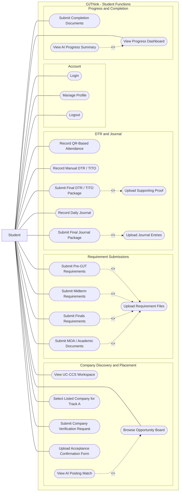
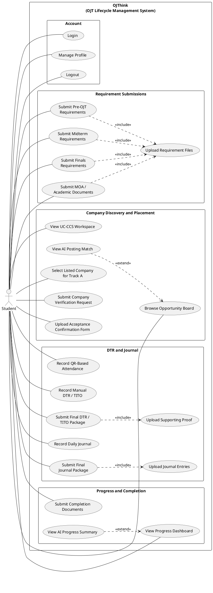
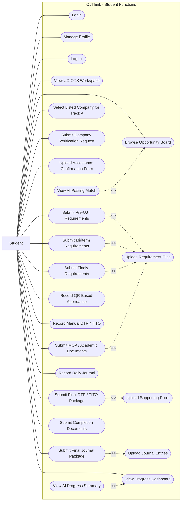
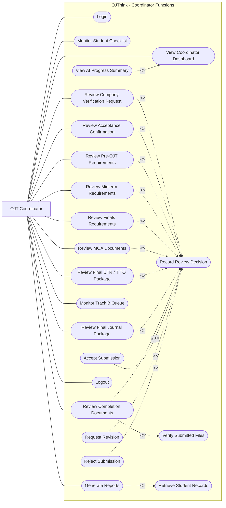
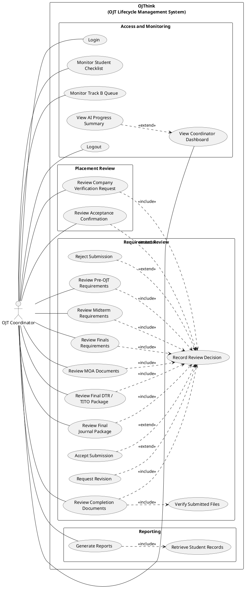
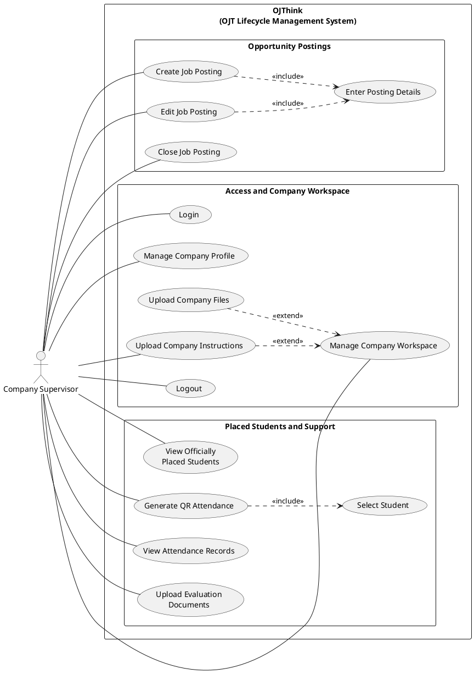
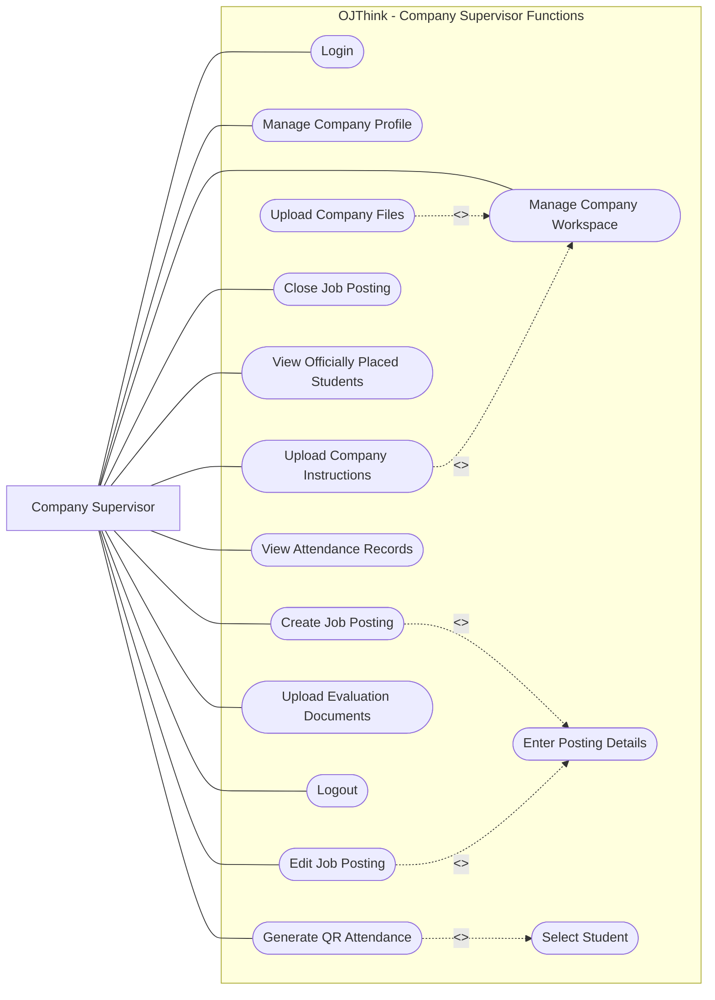
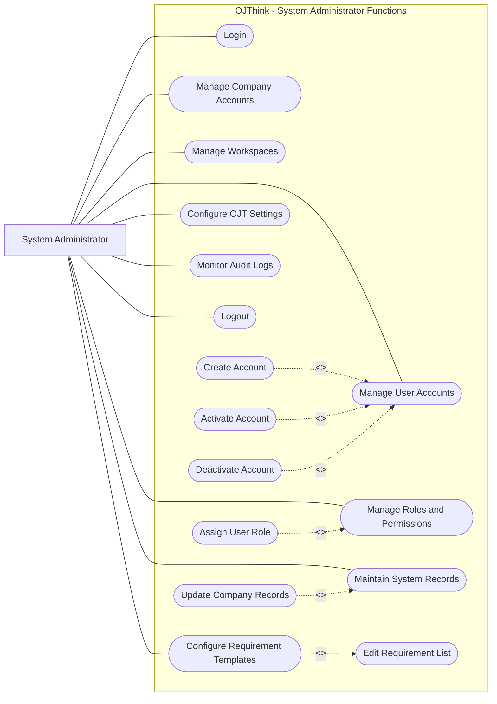
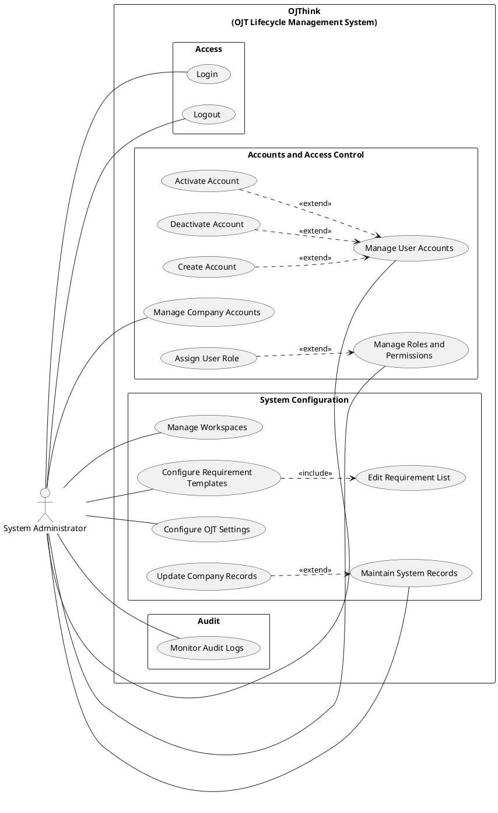

# OJThink UML Use Case Diagrams

System: **OJThink (OJT Lifecycle Management System)**

These diagrams follow the finalized OJThink scope. PlantUML is the normative
UML 2.x representation. Mermaid does not provide a native UML use-case diagram
type, so the Mermaid versions use flowcharts with actors, system boundaries,
use-case-shaped nodes, associations, and labeled dependency arrows.

Terminology correction:

- "Submit Proposed Company (Track B)" is modeled as **Submit Company
  Verification Request**.
- Company Verification only verifies an outside company candidate.
- The official Track A or Track B classification happens only when the OJT
  Coordinator accepts the Acceptance Confirmation / Confirmation Slip.

---

## 1. Student Use Case Diagram

### UML Use Case Diagram

### PlantUML Code

### Mermaid Code

### Relationship Explanation

- Requirement submission includes file upload because the submission cannot be
  completed without its required files.
- Final DTR submission includes supporting proof.
- Final journal submission includes the journal entries in the package.
- AI Posting Match optionally extends browsing the Opportunity Board.
- AI Progress Summary optionally extends the Progress Dashboard.
- Company Verification is intentionally separate from official Track B
  classification.

---

## 2. OJT Coordinator Use Case Diagram

### UML Use Case Diagram

### PlantUML Code

### Mermaid Code

### Relationship Explanation

- Each official review includes recording a review decision.
- Accept, Request Revision, and Reject extend the decision because they are
  mutually exclusive conditional outcomes. They are not modeled as mandatory
  includes.
- Completion review includes verifying submitted files.
- Report generation includes retrieving the relevant student records.
- AI Progress Summary optionally extends the Coordinator Dashboard.

---

## 3. Company Supervisor Use Case Diagram

### UML Use Case Diagram

### PlantUML Code

### Mermaid Code

### Relationship Explanation

- Creating or editing a posting includes entering posting details.
- QR attendance includes selecting the relevant officially placed student.
- Uploading company files and instructions extend workspace management because
  they are optional workspace-management actions.
- No application review, interview, or hiring use case is included because
  those activities happen outside OJThink.

---

## 4. System Administrator Use Case Diagram

### UML Use Case Diagram

### PlantUML Code

### Mermaid Code

### Relationship Explanation

- Create, Activate, and Deactivate Account extend account management because
  they are alternative actions, not steps that always happen together.
- Assign User Role optionally extends role and permission management.
- Configuring requirement templates includes editing the requirement list.
- Updating company records optionally extends system-record maintenance.
- No academic approval use cases are assigned to the administrator.

---

## Modeling Notes

1. Login and Logout are associated directly with each actor. They are not
   included by every use case because that would add unnecessary dependency
   lines and imply repeated authentication.
2. Approve and Reject are not both included by a review. They are mutually
   exclusive outcomes, so they extend the shared Record Review Decision use
   case.
3. Track A / Track B is officially saved only after the coordinator accepts the
   Acceptance Confirmation / Confirmation Slip.
4. Company Verification does not confirm placement, route a workspace, or
   activate DTR and journal tracking.
5. Daily DTR and journal records are student-maintained. Only final packages
   are coordinator-reviewed.
